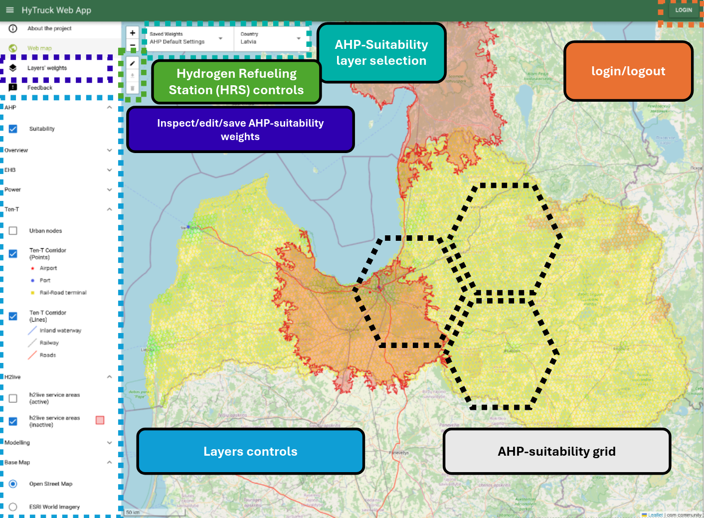
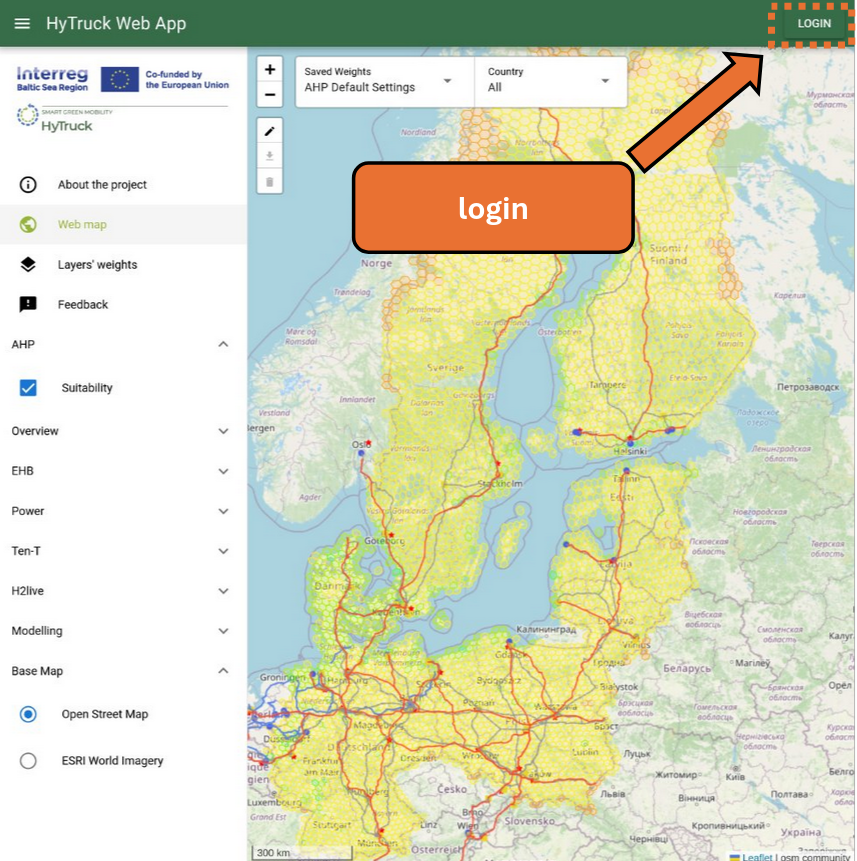
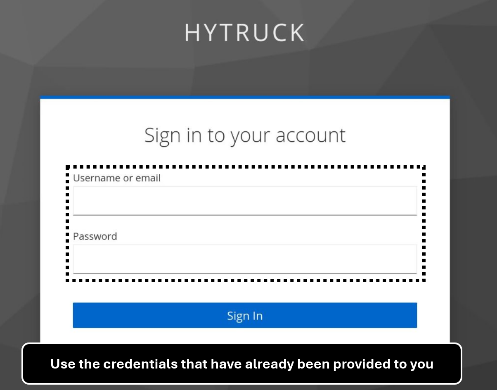
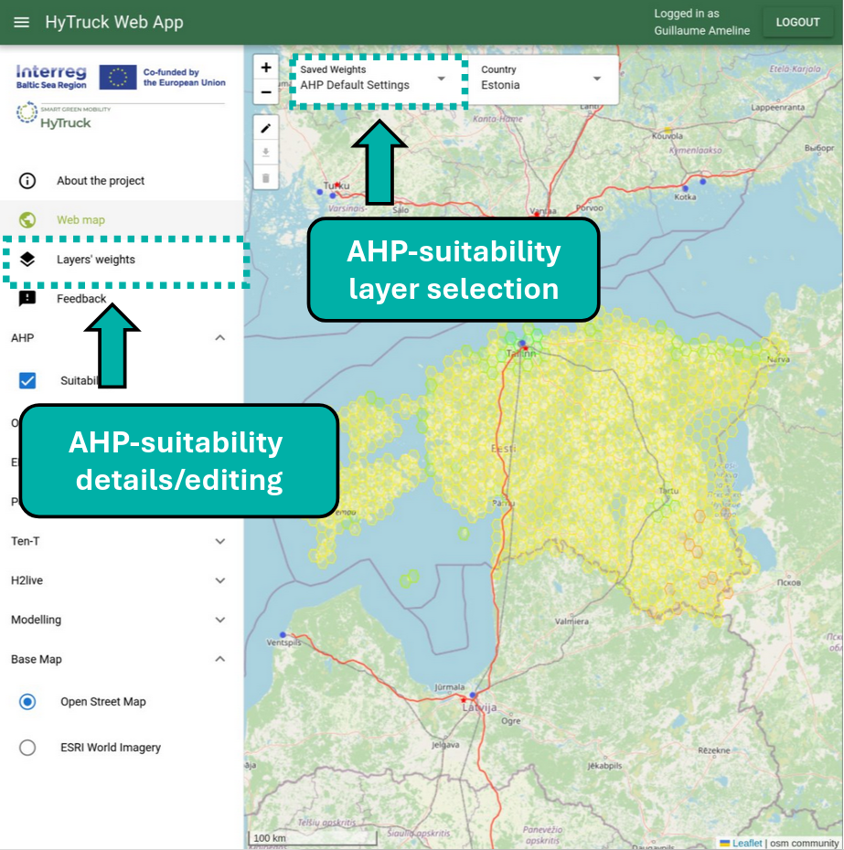
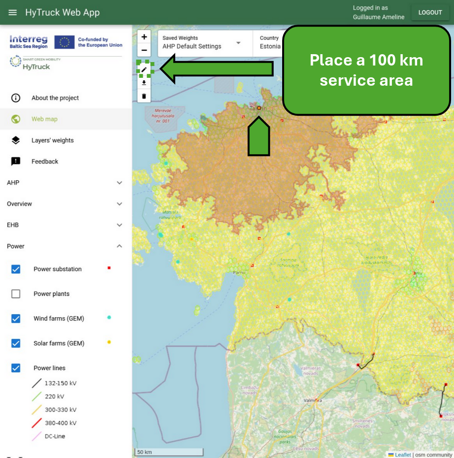
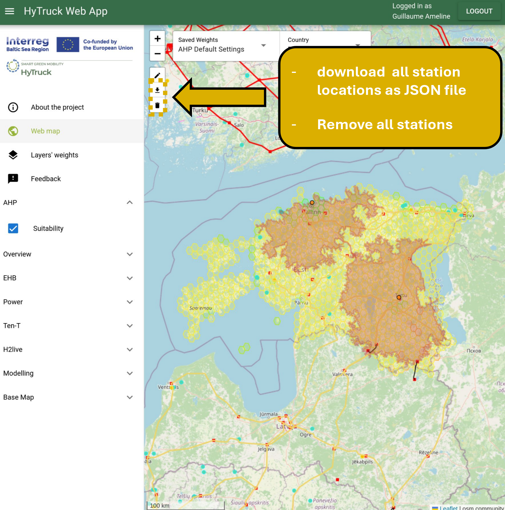
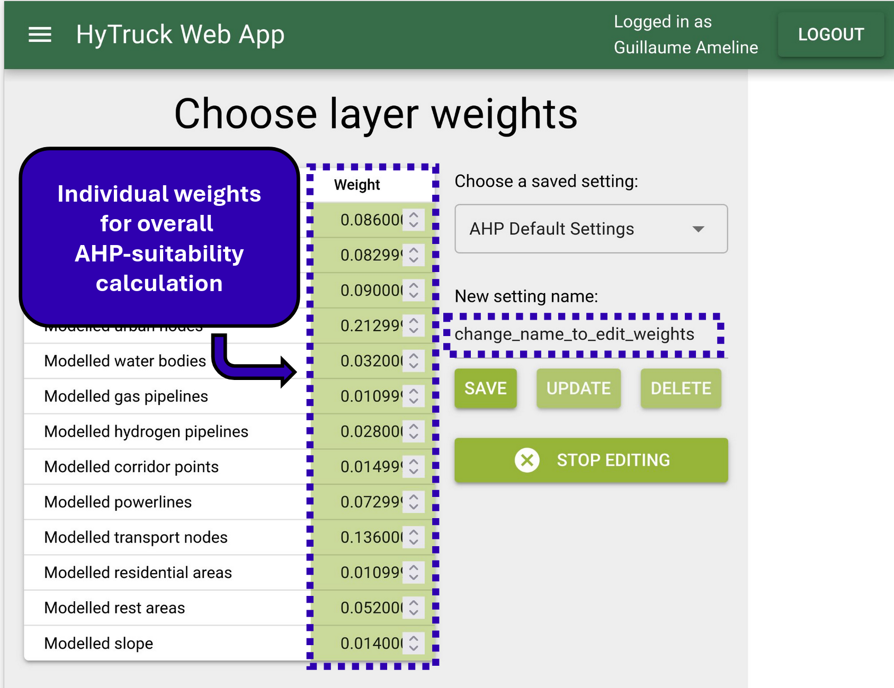
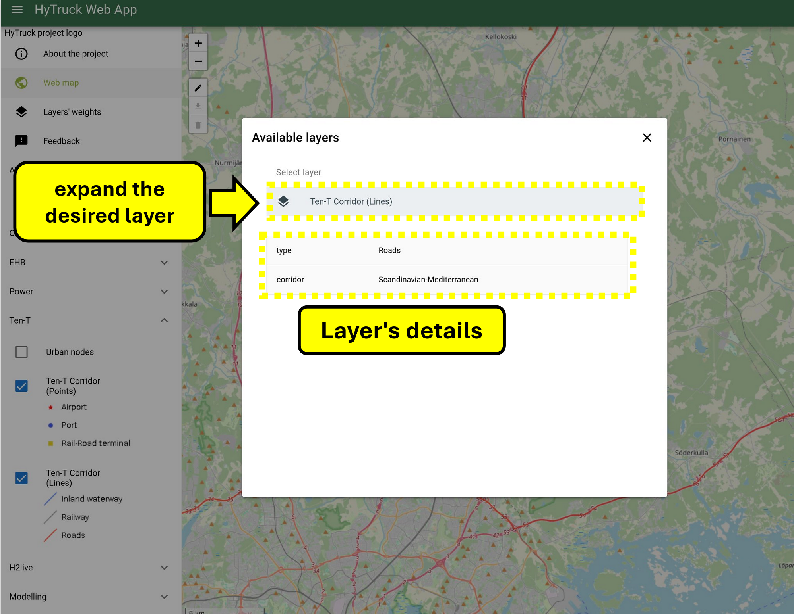
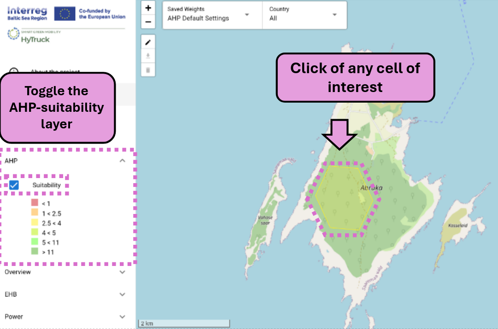
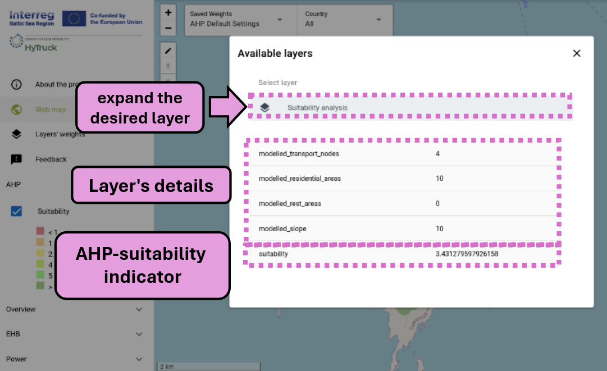

# Basic usage

## Interface overview

The interface consists of four main sections:

- Main map display with navigation controls
- User login (top right)
- Layer controls (left panel)
- Hydrogen refueling Station (HRS) placement tools (top left of the map)

  

## Core features

### 1. User Authentication
- Login required only for saving custom AHP-suitability weights
- Credentials provided by HyTruck project team

  
  

### 2. Area analysis

#### AHP-Suitability Layers

##### Activate
Toggle the suitability layer under *AHP* in the left panel

##### Select region

Choose a country to focus analysis and restrict display of AHP-suitability layer.

##### Select weights
Available options:

- Default AHP settings (all users)
- Survey-based settings (all users)
- Custom weights (logged-in users only) from [AHP-suitability layers' weights editing](#suitability-layers-weights)

  

#### Feature layers
Provide additional information in parralel of the AHP-suitability indicator.  
Toggle feature layers for them to be loaded on the map

### 3. Station planning

 to select a location and view a 100 km coverage range

  

 to download all placed stations (HRS) locations as a file (JSON)  
 to clear all placed stations  

  

### 4. Layer management

#### Weights configuration

- Access through *Layers' Weights* panel
- Create custom configurations (logged-in users)
- Save configurations with unique names (logged-in users)
    - It will then be available under the [AHP-suitability layers](#ahp-suitability-layers)

## Suitability layers weights

Weights of individual layer used for computation of the AHP-suitability are accessible under *Layers' weights*.  
**if you are logged in** you can:

- create your own AHP-suitability layer by changing the name of an existing layer 
- modify its weights
- save it  

  

#### Geographic information

##### Features
Click on an feature (ex: lines, points) to display details.

  

  

##### AHP-suitability grid
Click on a cell to display details.

  

  

