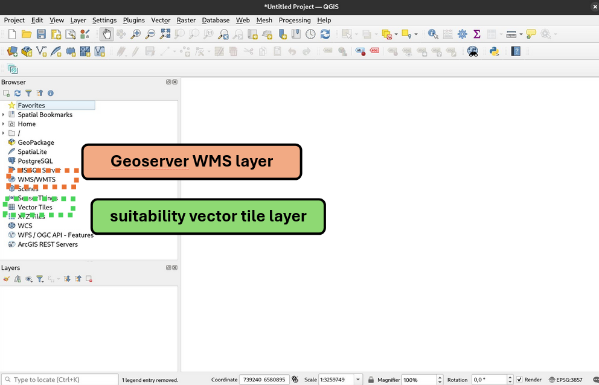
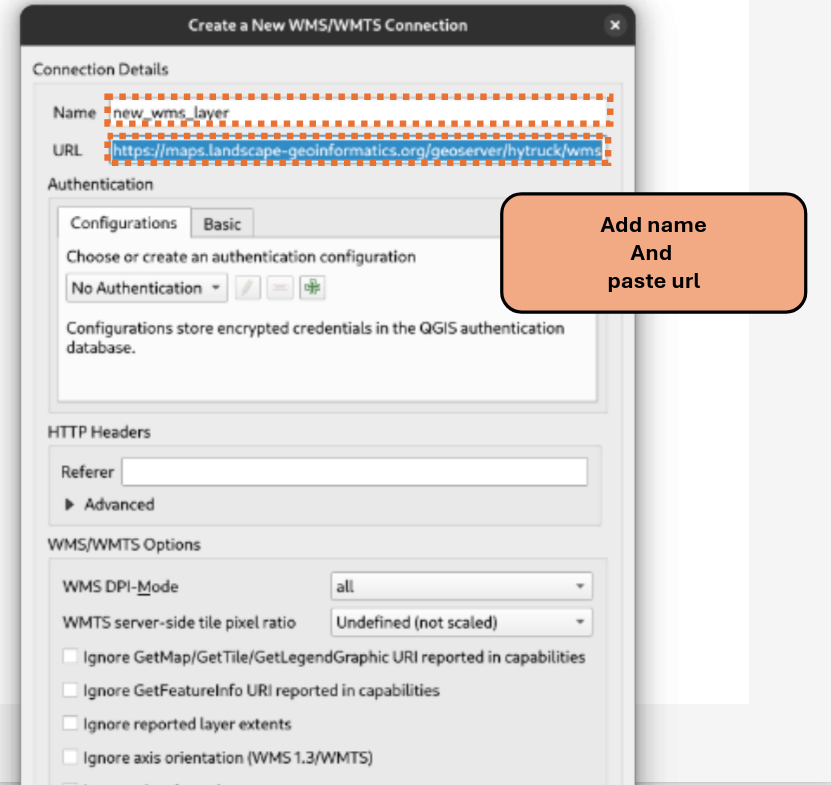
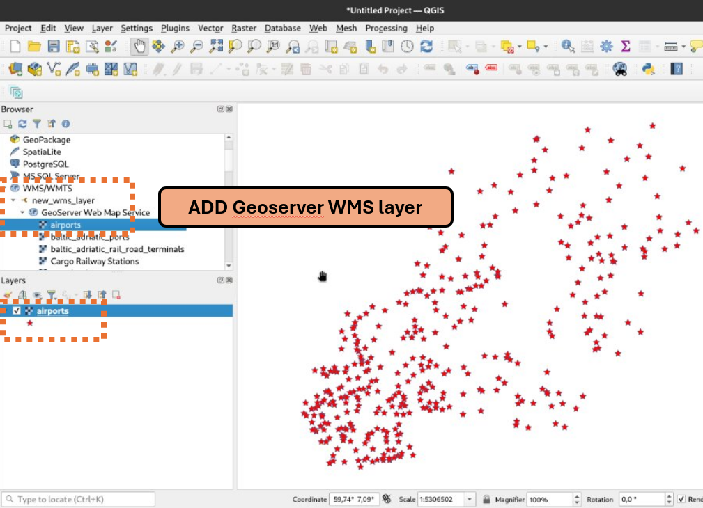
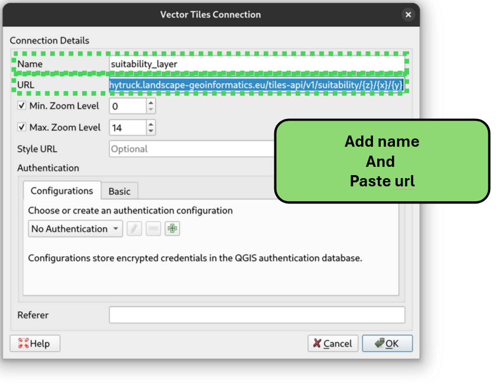
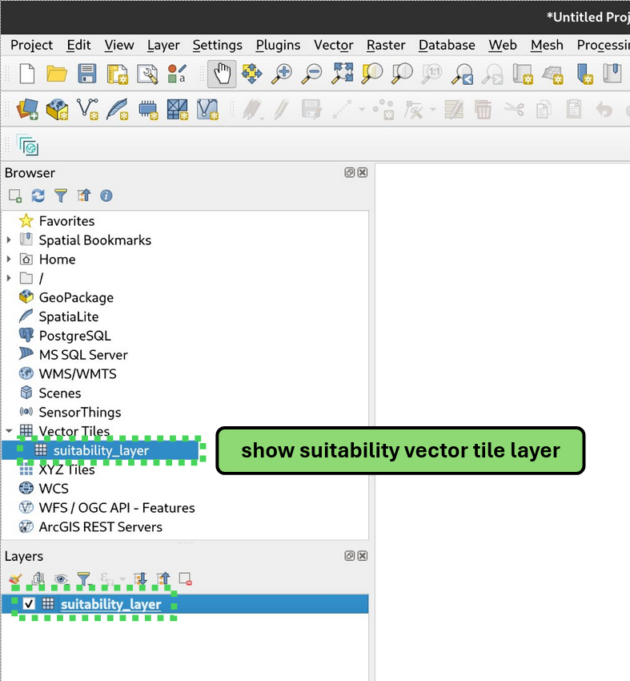

# Import layers to QGIS

Open QGIS

## WMS geoserver layers

- Layer
- Add WMS Layer
- Add new layer information
- Add new layer information
    - Add name: the name as it will be shown in GQIG
    - Paste url: `https://maps.landscape-geoinformatics.org/geoserver/hytruck/wms`
- Save
- In the *Browser* left panel, double click or right click, add *Layer to Project*

## Vector tiles HyTruck AHP-suitability layer

- Layer
- Add Vector Tile Layer
- Add new layer information
    - Add name: you want it to show in GQIG
    - Paste url: `https://hytruck.landscape-geoinformatics.eu/tiles-api/v1/suitability/{z}/{x}/{y}`
- Save
- In the *Browser* left panel, double click or right click, add *Layer to Project*

